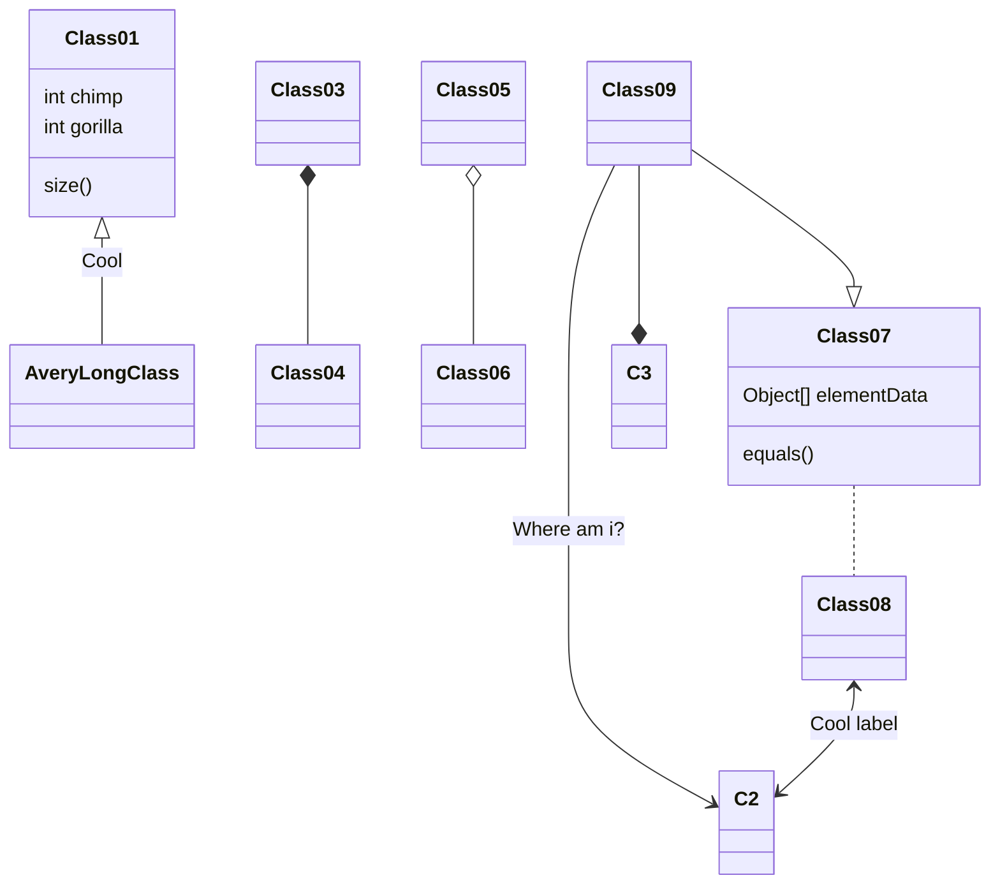
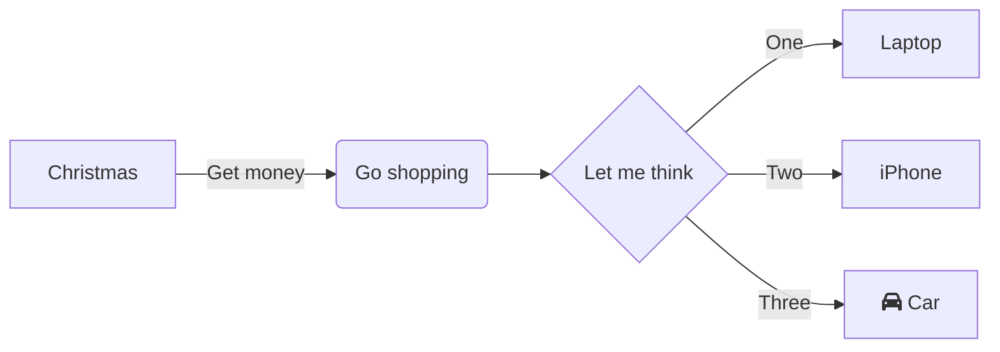
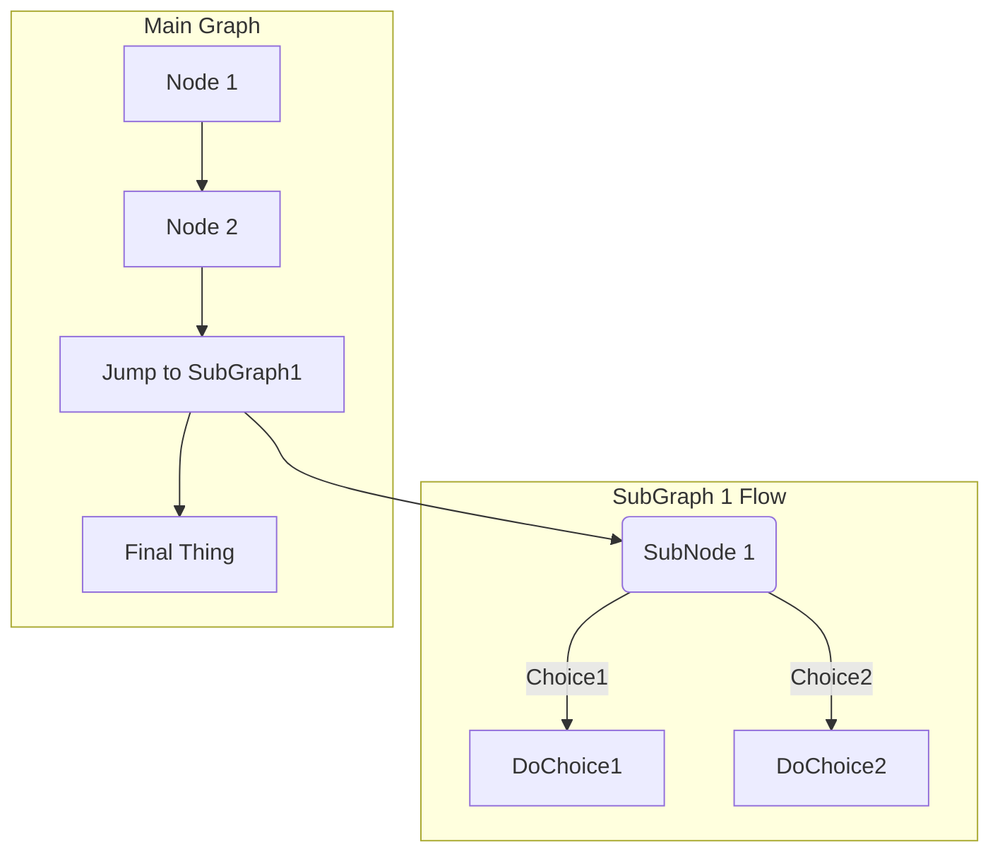

# Main title

## Sub title

This is something
> And this is something else




``` sql
SELECT THIS
FROM THAT
WHERE a=b
```

## test 2


| Syntax      | Description |
| ----------- | ----------- |
| Header      | Title       |
| Paragraph   | Text        |

Next change

## uml: sequence diagram
Here I will embed PlantUML markup to generate a sequence diagram.

I can include as many plantuml segments as I want in my Markdown, and the diagrams can be of any type supported by PlantUML.


## another very important piece of DB information

This is a test of commits

### very special subprocess

1. this
2. that
3. something else


